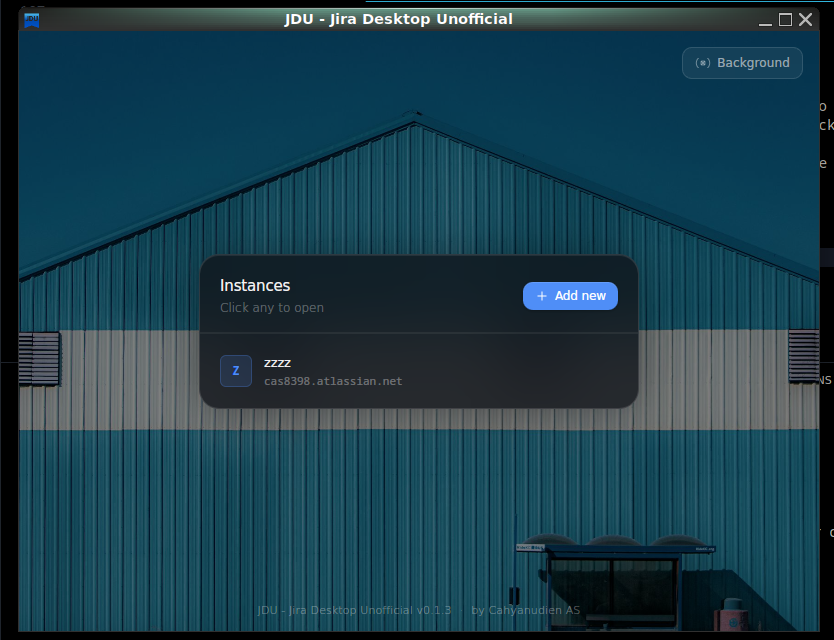

<div align="center">



# Jira Desktop Unofficial (JDU)

**A minimal, distraction-free Jira desktop wrapper built with [Tauri](https://tauri.app/) + Rust.**  
No tabs. No Electron. No bloat. Just your work.

[](https://github.com/cas8398/jira-desktop-unofficial/releases)
[](https://github.com/cas8398/jira-desktop-unofficial/stargazers)
[](https://github.com/cas8398/jira-desktop-unofficial/issues)
[](https://github.com/cas8398/jira-desktop-unofficial/blob/master/LICENSE)
[](https://tauri.app/)
[](https://github.com/cas8398/jira-desktop-unofficial/releases)

## [](https://sourceforge.net/projects/jira-desktop-unofficial/) [](https://github.com/cas8398/jira-desktop-unofficial/releases)

[🌐 Website](https://cas8398.github.io/jira-desktop-unofficial/) · [📦 Download](https://github.com/cas8398/jira-desktop-unofficial/releases) · [🐛 Report Bug](https://github.com/cas8398/jira-desktop-unofficial/issues) · [💡 Request Feature](https://github.com/cas8398/jira-desktop-unofficial/discussions)

</div>

---

## 📝 What's New in v0.1.3

- 🎨 **5 New Backgrounds** — Beautiful Pexels images to personalize your workspace
- 🔄 **Dynamic Window Titles** — Titles now update based on the Jira page you're viewing
- ✨ **Modern UI Redesign** — Cleaner, fresher interface
- 🐛 **Better URL Validation** — Fixed issues with trailing slashes and root paths

> See [CHANGELOG.md](CHANGELOG.md) for the full version history.

---

## 🖥️ What Is It?

Jira Desktop Unofficial is a clean, focused desktop wrapper for Jira. It gives Jira its own dedicated window on your desktop — similar to how Slack, Discord, or VS Code operate as standalone apps — but without the resource overhead of Electron.

Fast. Secure. Memory-efficient. Open source.

---

## ✨ Features

| Feature                        | Description                                                   |
| ------------------------------ | ------------------------------------------------------------- |
| 🖥️ **Dedicated Window**        | Jira in its own window, completely separate from your browser |
| ⚡ **Ultra-lightweight**       | ~80 MB RAM, ~8 MB download, starts in under 2 seconds         |
| 🔒 **Privacy-focused**         | Zero tracking, zero telemetry, zero data collection           |
| 🌐 **Universal compatibility** | Works with Jira Cloud, Server, and Data Center                |
| 🧠 **Smart memory**            | Remembers your Jira URL and window preferences                |
| 🎨 **Custom backgrounds**      | Choose from 5 beautiful Pexels images                         |
| 🔄 **Dynamic titles**          | Window title updates based on the Jira page you're on         |
| 📱 **Multi-platform**          | Windows, macOS, and Linux                                     |
| 🏠 **Native feel**             | Integrates with your OS seamlessly                            |

---

## 🚀 Getting Started

1. **[Download](https://github.com/cas8398/jira-desktop-unofficial/releases)** the latest release for your OS
2. **Install** the app
3. **Launch** and enter your Jira URL (e.g. `https://company.atlassian.net`)
4. **Focus** — enjoy a distraction-free Jira experience 🎯

### Supported Jira Instances

- ☁️ Jira Cloud (`*.atlassian.net`)
- 🖥️ Jira Server (self-hosted)
- 🏢 Jira Data Center

### Platform-Specific Notes

> ⚠️ **Windows users:** This app uses Microsoft Edge **WebView2** for rendering. Please ensure it is installed on your system. Most modern Windows machines already have it.

---

## 📦 Download

<div align="center">

| Platform   | Installer                                                                                               |
| ---------- | ------------------------------------------------------------------------------------------------------- |
| 🪟 Windows | `.msi` / `.exe` — [Download](https://github.com/cas8398/jira-desktop-unofficial/releases)               |
| 🍎 macOS   | `.dmg` — [Download](https://github.com/cas8398/jira-desktop-unofficial/releases)                        |
| 🐧 Linux   | `.AppImage` / `.deb` / `.rpm` — [Download](https://github.com/cas8398/jira-desktop-unofficial/releases) |

Also available on **SourceForge**:

[](https://sourceforge.net/projects/jira-desktop-unofficial/files/latest/download)

</div>

---

## 📈 Performance Comparison

| Metric         | Jira Desktop Unofficial | Typical Electron App | Browser Tab            |
| -------------- | ----------------------- | -------------------- | ---------------------- |
| Memory Usage   | **~80 MB**              | ~350 MB              | ~150 MB                |
| Startup Time   | **< 2 seconds**         | 5–8 seconds          | Instant                |
| Download Size  | **~8 MB**               | ~120 MB              | N/A                    |
| Background CPU | **Minimal**             | Moderate             | High (with other tabs) |

---

## 🧩 Why Tauri, Not Electron?

### The Electron Problem

- **Memory hungry** — Often 300–500 MB+ of RAM
- **Large bundles** — Downloads frequently exceed 100 MB
- **Security concerns** — Full Node.js runtime exposed to the frontend
- **Bloated** — Ships a full copy of Chromium with every app

### The Tauri Advantage

- ✅ **Efficient** — Typically under 80–100 MB RAM
- ✅ **Tiny** — Downloads under 10 MB
- ✅ **Secure** — Isolated Rust backend with minimal frontend permissions
- ✅ **Native** — Uses your OS's built-in webview (no bundled browser engine)
- ✅ **Modern** — Built for the future of desktop apps

---

## 🛠️ Build from Source

Requires [Rust](https://www.rust-lang.org/tools/install), [Node.js](https://nodejs.org/), [pnpm](https://pnpm.io/), and [Tauri prerequisites](https://tauri.app/start/prerequisites/) for your platform.

```bash
git clone https://github.com/cas8398/jira-desktop-unofficial
cd jira-desktop-unofficial
pnpm install
pnpm tauri build
```

For development:

```bash
pnpm tauri dev
```

---

## 🎯 Who Is This For?

If you're someone who:

- Spends significant time in Jira daily
- Values focus and minimalism in their tools
- Wants to reclaim browser tab real estate
- Appreciates lightweight, efficient software
- Prefers open-source solutions

…then Jira Desktop Unofficial is for you.

---

## 🤝 Contributing & Community

This project is open source and community-driven!

- 🐛 **Found a bug?** [Open an issue](https://github.com/cas8398/jira-desktop-unofficial/issues) with your OS, app version, and what happened.
- 💡 **Have an idea?** Start a [Discussion](https://github.com/cas8398/jira-desktop-unofficial/discussions).
- 🛠️ **Want to contribute?** Fork the repo and open a Pull Request — all contributions welcome.

---

## 🙏 Acknowledgments

Built with ❤️ using the amazing [Tauri framework](https://tauri.app/). Special thanks to the Tauri team for creating such an elegant solution for cross-platform desktop apps.

Background images provided by [Pexels](https://www.pexels.com/).

---

<div align="center">

**Not affiliated with or endorsed by Atlassian. Jira is a registered trademark of Atlassian Corporation Plc.**

⭐ **If you find this useful, please [star the repo](https://github.com/cas8398/jira-desktop-unofficial)!** It helps others discover the project.

</div>
